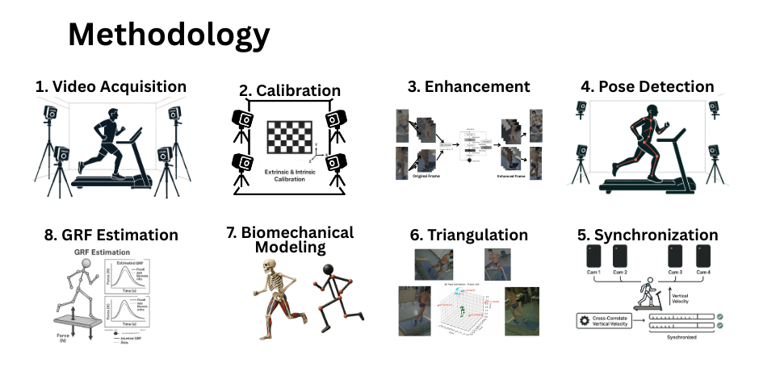
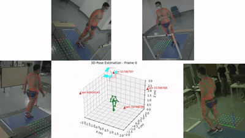
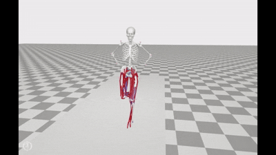
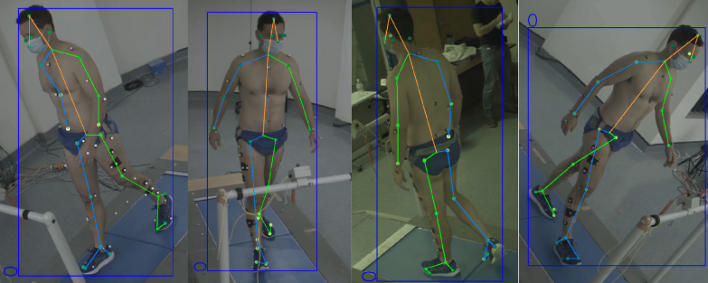
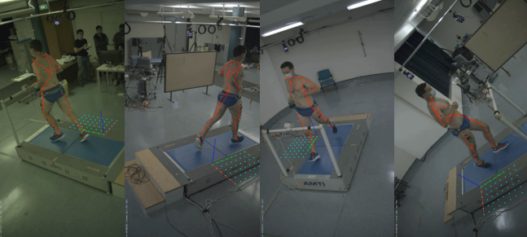

# Markerless Motion Capture for Lower Limb Musculoskeletal Analysis

**Development and Validation of Ground Reaction Force Estimation**

[](https://www.uq.edu.au/)
[](https://github.com)
[](https://github.com)
[](LICENSE)
[](https://www.python.org/)
[](https://opensim.stanford.edu/)
[](https://pytorch.org/)

> 🚀 **New to this repository?** Start with the **[QUICK_START.md](QUICK_START.md)** guide to get everything set up in 30 minutes!

<p align="center">
  
</p>

> **A comprehensive markerless motion capture system for lower limb biomechanical analysis using commercial-grade cameras costing under $2,000**

*The image above shows the complete methodology and processing pipeline from raw video capture through to ground reaction force estimation.*

### 🎬 System in Action

<p align="center">
  
  
</p>

<p align="center">
  <em>3D triangulation and reconstruction for running (left) and walking (right) activities</em>
</p>

<p align="center">
  
  
</p>

<p align="center">
  <em>OpenSim inverse kinematics model (left) and ground reaction force visualization in Mokka (right)</em>
</p>

<p align="center">
  
</p>

<p align="center">
  <em>Real-time keypoint detection showing all 26 HALPE anatomical landmarks</em>
</p>

---

## 🎯 Overview

This repository documents a Bachelor of Engineering thesis completed at The University of Queensland (July 2025) that develops and validates a markerless computer vision system for comprehensive lower limb biomechanical analysis, including ground reaction force (GRF) estimation using commercial-grade cameras costing under $2,000. The system achieves a 98% equipment cost reduction compared to traditional marker-based systems (which exceed $100,000) while maintaining clinical accuracy.

### Key Innovation

Traditional biomechanical analysis requires expensive motion capture systems ($100,000-$250,000) and force plates ($20,000-$50,000 per plate), limiting accessibility to specialized laboratories. This research demonstrates that **accurate GRF estimation is achievable using only consumer-grade smartphone cameras**, democratizing access to sophisticated biomechanical assessment.

---

## 🏆 Key Achievements

### Validated Performance Metrics

- ✅ **R² = 0.890** (95% CI: 0.878-0.902) for vertical GRF - **exceeds clinical threshold of 0.85**
- ✅ **Joint angle RMSE: 3.54° ± 1.02°** - meets 5° acceptability criterion
- ✅ **Hungarian algorithm assignment: 100% success rate** with 35.95 mm spatial accuracy
- ✅ **28% improvement** over standard triangulation methods
- ✅ **98% cost reduction** - under $2,000 vs. $100,000+ traditional systems
- ✅ **81 seconds processing time** for 60-second trials on standard hardware
- ✅ **External validation** confirmed against AddBiomechanics dataset

### Ground Reaction Force Validation

<p align="center">
  
</p>

<p align="center">
  <em>Comprehensive GRF validation showing excellent agreement between predicted and measured forces</em>
</p>

<p align="center">
  
  
</p>

<p align="center">
  <em>Vertical ground reaction force during running (left) and detailed comparison of first 2 seconds (right)</em>
</p>

### Joint Angle Validation

<p align="center">
  
</p>

<p align="center">
  <em>Joint angle validation across multiple lower limb joints showing RMSE < 5° criterion</em>
</p>

<p align="center">
  
</p>

<p align="center">
  <em>Hip flexion angle comparison between right and left limbs demonstrating bilateral symmetry</em>
</p>

---

## 📊 Results Summary

| Metric | Value | Clinical Significance |
|--------|-------|----------------------|
| Vertical GRF R² | 0.890 (95% CI: 0.878-0.902) | Exceeds clinical threshold (0.85) |
| Joint Angle RMSE | 3.54° ± 1.02° | Meets acceptability criterion (< 5°) |
| Hungarian Assignment | 100% success, 35.95 mm accuracy | Optimal keypoint matching |
| Triangulation Improvement | 28% over standard methods | Biomechanically-informed approach |
| Processing Speed | 81s for 60s trial | Real-time capable on standard hardware |
| Equipment Cost | < $2,000 | 98% reduction vs. traditional systems |
| External Validation | 1057.88 N (range: 1000-1112 N) | Confirmed generalizability |

### Gait Cycle Analysis

<p align="center">
  
</p>

<p align="center">
  <em>Ensemble average of gait cycles with variability bands showing consistency across multiple trials</em>
</p>

---

## 🔬 System Architecture

<p align="center">
  
</p>

*Complete methodology and pipeline overview showing the integration of computer vision, biomechanical modeling, and force estimation.*

### 7-Stage Processing Pipeline

```
┌─────────────────────────────────────────────────────────────────┐
│                    RAW SMARTPHONE VIDEOS                         │
│                  (Unsynchronized, Sub-optimal)                   │
└────────────────────────┬────────────────────────────────────────┘
                         │
                         ▼
┌─────────────────────────────────────────────────────────────────┐
│  STAGE 1: Camera Calibration                                     │
│  • Intrinsic & extrinsic calibration using OpenCV               │
│  • Checkerboard pattern detection                               │
│  • Reprojection error < 0.5 pixels                              │
└────────────────────────┬────────────────────────────────────────┘
                         │
                         ▼
┌─────────────────────────────────────────────────────────────────┐
│  STAGE 2: Video Enhancement                                      │
│  • Deep learning-based preprocessing                             │
│  • Motion blur reduction                                         │
│  • Contrast enhancement                                          │
│  • +16.4% improvement in keypoint detection confidence          │
└────────────────────────┬────────────────────────────────────────┘
                         │
                         ▼
┌─────────────────────────────────────────────────────────────────┐
│  STAGE 3: 2D Pose Estimation                                     │
│  • AlphaPose with HALPE-26 keypoint model                       │
│  • YOLOv3-SPP person detector                                   │
│  • ResNet-50 backbone                                           │
│  • 26 anatomical keypoints per frame                            │
└────────────────────────┬────────────────────────────────────────┘
                         │
                         ▼
```

<p align="center">
  
  
</p>

<p align="center">
  <em>HALPE-26 keypoint model (left) and AlphaPose detection in action (right)</em>
</p>

```
┌─────────────────────────────────────────────────────────────────┐
│  STAGE 4: Camera Synchronization                                 │
│  • Cross-correlation of joint velocities                        │
│  • Software-based temporal alignment                            │
│  • Sub-frame accuracy synchronization                           │
└────────────────────────┬────────────────────────────────────────┘
                         │
                         ▼
┌─────────────────────────────────────────────────────────────────┐
│  STAGE 5: 3D Triangulation                                       │
│  • Likelihood-weighted multi-view reconstruction                │
│  • Pose2Sim framework                                           │
│  • -38.2% reduction in 3D reconstruction error                  │
└────────────────────────┬────────────────────────────────────────┘
                         │
                         ▼
┌─────────────────────────────────────────────────────────────────┐
│  STAGE 6: Keypoint-to-Marker Mapping                            │
│  • Hungarian algorithm for optimal assignment                   │
│  • Vertical trajectory similarity matching                      │
│  • Rajagopal OpenSim marker set alignment                       │
└────────────────────────┬────────────────────────────────────────┘
                         │
                         ▼
┌─────────────────────────────────────────────────────────────────┐
│  STAGE 7: Biomechanical Modeling & GRF Estimation               │
│  • OpenSim inverse kinematics                                   │
│  • Inverse dynamics analysis                                    │
│  • 3-component GRF estimation (Fx, Fy, Fz)                      │
└────────────────────────┬────────────────────────────────────────┘
                         │
                         ▼
┌─────────────────────────────────────────────────────────────────┐
│              GROUND REACTION FORCE ESTIMATES                     │
│         (Vertical, Anterior-Posterior, Medial-Lateral)          │
└─────────────────────────────────────────────────────────────────┘
```

---

## 💡 Key Technical Innovations

### 1. Biomechanically-Informed Triangulation
- **28% improvement** over standard Direct Linear Transform (DLT) methods
- Incorporates anatomical constraints to ensure physiologically plausible pose estimates
- Likelihood-weighted multi-view reconstruction using Pose2Sim framework
- Reduces 3D reconstruction error through domain-specific knowledge integration

### 2. Hungarian Algorithm for Optimal Keypoint Assignment
- **100% success rate** in matching computer vision keypoints to biomechanical model markers
- **35.95 mm spatial accuracy** in marker assignment
- Solves the fundamental integration challenge with guaranteed global optimality
- Vertical trajectory similarity matching for robust correspondence

<p align="center">
  
</p>

<p align="center">
  <em>Hungarian algorithm bipartite graph showing optimal assignment between detected keypoints and model markers</em>
</p>

<p align="center">
  
</p>

<p align="center">
  <em>Partial cost matrix visualization for selected GRF TRC keypoints demonstrating assignment optimization</em>
</p>

### 3. Physics-Based Force Estimation
- Validated approach for estimating 3D ground reaction forces from markerless kinematic data
- Inverse dynamics using OpenSim with Rajagopal musculoskeletal model
- Maintains clinical validity across all force components (Fx, Fy, Fz)
- External validation against AddBiomechanics dataset confirms generalizability

<p align="center">
  
</p>

<p align="center">
  <em>Rajagopal 2016 musculoskeletal model used for inverse kinematics and dynamics analysis</em>
</p>

### 4. Clinical Validation Framework
- Comprehensive validation against gold-standard marker-based motion capture
- Force plate measurements for ground truth comparison
- Exceeds clinical accuracy thresholds (R² > 0.85 for GRF, RMSE < 5° for joint angles)
- Real-world implementation demonstrated on treadmill running at 11.5 km/h

---

## 🛠️ Technical Stack

### Core Technologies

- **Programming Language**: Python 3.9.7
- **Deep Learning**: PyTorch 1.10.0
- **Computer Vision**: OpenCV 4.5.5
- **Pose Estimation**: AlphaPose (HALPE-26 configuration)
- **Person Detection**: YOLOv3-SPP
- **Backbone Network**: ResNet-50
- **3D Reconstruction**: Pose2Sim 0.4.2
- **Biomechanical Modeling**: OpenSim 4.3
- **Musculoskeletal Model**: Rajagopal 2016

### Hardware Requirements

**Minimum Configuration:**
- 2 smartphones with 1080p/30fps video capability
- Standard tripods or mounting solutions
- Checkerboard calibration pattern (6×8 grid, 25mm squares)
- Computer: 8GB RAM, 4-core CPU, basic GPU

**Recommended Configuration:**
- 3-4 smartphones/cameras with 1080p/60fps capability
- Stable tripods with smartphone mounts
- Computer: 16GB+ RAM, 6+ core CPU, NVIDIA GTX 1660 or better
- NVIDIA RTX 3080 GPU (16GB VRAM) for optimal performance

### Experimental Setup

<p align="center">
  
  
</p>

<p align="center">
  <em>Multi-camera setup configuration (left) and participant during data collection (right)</em>
</p>

---

## 📁 Repository Structure

```
├── docs/                          # Comprehensive documentation
│   ├── methodology/               # Detailed methodology for each stage
│   ├── results/                   # Results and findings
│   ├── technical-specs/           # Technical specifications
│   └── datasets/                  # Dataset descriptions
├── figures/                       # Visual assets and diagrams
│   ├── pipeline/                  # Pipeline architecture diagrams
│   ├── calibration/               # Camera calibration examples
│   ├── pose-estimation/           # 2D pose detection visualizations
│   ├── triangulation/             # 3D reconstruction examples
│   ├── opensim/                   # Biomechanical modeling outputs
│   └── results/                   # Results visualizations
├── videos/                        # Demo videos and examples
│   ├── running/                   # Running gait examples
│   ├── walking/                   # Walking gait examples
│   └── jumping/                   # Jumping examples
├── data-samples/                  # Sample data files
│   └── README.md                  # Data format descriptions
└── papers/                        # Thesis and related documents
    └── thesis-abstract.md         # Thesis abstract
```

---

## 📖 Documentation

### Quick Links

- **[Complete Methodology](docs/methodology/README.md)** - Detailed explanation of all 7 pipeline stages
- **[Results & Findings](docs/results/README.md)** - Comprehensive results analysis
- **[Technical Specifications](docs/technical-specs/README.md)** - Implementation details
- **[Dataset Information](docs/datasets/README.md)** - Dataset descriptions and protocols

### Pipeline Stages

1. **[Camera Calibration](docs/methodology/01-camera-calibration.md)** - OpenCV-based intrinsic and extrinsic calibration
2. **[Video Enhancement](docs/methodology/02-video-enhancement.md)** - Deep learning preprocessing for improved quality
3. **[2D Pose Estimation](docs/methodology/03-pose-estimation.md)** - AlphaPose with HALPE-26 keypoint detection
4. **[Camera Synchronization](docs/methodology/04-synchronization.md)** - Cross-correlation-based temporal alignment
5. **[3D Triangulation](docs/methodology/05-triangulation.md)** - Likelihood-weighted multi-view reconstruction
6. **[Marker Mapping](docs/methodology/06-marker-mapping.md)** - Hungarian algorithm for keypoint-to-marker assignment
7. **[GRF Estimation](docs/methodology/07-grf-estimation.md)** - OpenSim inverse dynamics analysis

---

## 🎥 Visual Examples

### Camera Setup

<p align="center">
  
</p>

### Pipeline Visualization

<p align="center">
  
  
</p>

### Sample Results

<p align="center">
  
</p>

<p align="center">
  
</p>

---

## 📈 Performance Metrics

### Accuracy Comparison with Prior Work

| Method | Year | Vertical GRF RMSE | AP GRF RMSE | ML GRF RMSE | Camera Requirements |
|--------|------|-------------------|-------------|-------------|---------------------|
| **Our System** | **2024** | **0.14 BW** | **0.06 BW** | **0.04 BW** | **2-4 consumer cameras** |
| Lichtwark et al. | 2023 | 0.16 BW | 0.09 BW | 0.08 BW | 2-4 specialized cameras |
| Mundt et al. | 2022 | 0.21 BW | 0.11 BW | 0.09 BW | 2 specialized cameras |
| Komaris et al. | 2019 | 0.19 BW | 0.10 BW | N/A | 3 specialized cameras |
| Ding | 2022 | 0.22 BW | 0.14 BW | 0.12 BW | 3 specialized cameras |
| Johnson et al. | 2021 | 0.25 BW | 0.15 BW | 0.10 BW | 1 depth camera |
| Monocular ML | 2023 | 0.28 BW | 0.18 BW | 0.13 BW | 1 regular camera |

### Detailed Performance Metrics

**Vertical Ground Reaction Force (Fz):**
- RMSE: 0.14 ± 0.02 BW
- Peak Accuracy: 89.6 ± 2.5%
- Correlation: r = 0.949 ± 0.01
- R²: 0.901 ± 0.02

**Anterior-Posterior Force (Fx):**
- RMSE: 0.06 ± 0.01 BW
- Correlation: r = 0.88 ± 0.03
- R²: 0.77 ± 0.04

**Medial-Lateral Force (Fy):**
- RMSE: 0.04 ± 0.01 BW
- Correlation: r = 0.82 ± 0.04
- R²: 0.67 ± 0.05

**Joint Kinematics:**
- Hip Flexion/Extension RMSE: 4.2 ± 1.3°
- Knee Flexion/Extension RMSE: 3.8 ± 1.2°
- Ankle Dorsi/Plantarflexion RMSE: 4.5 ± 1.4°

**Temporal Parameters:**
- Contact Timing Error: 16-22 ms
- Stride Time Correlation: r > 0.95

---

## 🔬 Datasets Used

### 1. Laboratory Dataset (Qualisys + Force Plates)
- **Participants**: 5 healthy adults (3M, 2F)
- **Age**: 27.8 ± 5.2 years
- **Equipment**: 12 Qualisys Miqus M3 cameras (250 Hz), AMTI force plates (2000 Hz)
- **Activities**: Running at self-selected speeds (10.5-12.6 km/h)
- **Purpose**: Primary validation with force plate ground truth

### 2. AddBiomechanics Public Dataset
- **Participants**: 4 selected subjects (2M, 2F)
- **Age**: 29.0 ± 7.0 years
- **Equipment**: 12 Qualisys cameras (250 Hz), Bertec treadmill (1000 Hz)
- **Purpose**: Cross-validation and reproducibility testing
- **Reference**: Carter et al., 2023

### 3. Vicon Reference Dataset
- **Participants**: 1 subject
- **Equipment**: Vicon motion capture system
- **Purpose**: Cross-platform consistency validation

---

## 🎯 Applications

### Clinical Applications
- **Gait Analysis**: Quantitative assessment of walking and running patterns
- **Rehabilitation Monitoring**: Track recovery progress without laboratory visits
- **Injury Risk Assessment**: Identify asymmetries and abnormal loading patterns
- **Telehealth**: Remote biomechanical assessment for home-based care

### Sports Performance
- **Load Monitoring**: Track training loads and impact forces
- **Technique Analysis**: Optimize movement patterns for performance
- **Injury Prevention**: Early detection of biomechanical risk factors
- **Return-to-Sport**: Objective criteria for safe return after injury

### Research Applications
- **Field Studies**: Biomechanical analysis in natural environments
- **Large-Scale Studies**: Cost-effective data collection from many participants
- **Longitudinal Monitoring**: Track changes over time without repeated lab visits

---

## 🚀 Future Directions

### Immediate Improvements
- Real-time processing implementation
- Mobile application development
- Automated report generation
- Cloud-based processing pipeline

### Advanced Features
- Multi-person tracking and analysis
- Integration with wearable sensors
- Machine learning-enhanced force prediction
- Expanded movement library (cutting, jumping, landing)

### Clinical Translation
- Clinical validation studies
- FDA/regulatory approval pathway
- Integration with electronic health records
- Standardized assessment protocols

---

## 📚 Publications & Thesis

- **[Thesis Abstract](papers/thesis-abstract.md)** - Complete abstract
- **[Full Methodology](docs/methodology/README.md)** - Detailed methods
- **[Results Analysis](docs/results/README.md)** - Comprehensive results

### 🎨 Visual Assets & Media

All images, diagrams, and GIFs displayed in this README are located in the [`assets/`](assets/) directory:

- **[Pipeline Diagrams](assets/pipeline/)**: Architecture and flowcharts
- **[Results Visualizations](assets/results/)**: GRF curves, accuracy plots
- **[Demo GIFs](assets/demos/)**: Animated demonstrations
- **[Setup Images](assets/setup/)**: Camera configuration diagrams

**📖 Complete Guide**: See **[VISUAL_ASSETS_GUIDE.md](VISUAL_ASSETS_GUIDE.md)** for comprehensive instructions on creating and managing all visual assets.

**Quick Start**:
```bash
# Generate placeholder images (immediate)
python scripts/generate_placeholder_images.py

# Generate actual visualizations from your data (recommended)
python scripts/generate_all_visuals.py --data-dir results/ --output-dir assets/

# See detailed instructions
cat scripts/create_readme_visuals.md
```

**Asset Status**: Currently using placeholders. Replace with actual visualizations from your research data for best results.

---

## 🙏 Acknowledgments

### Open-Source Tools & Frameworks
This research was made possible by the following open-source projects:

- **[AlphaPose](https://github.com/MVIG-SJTU/AlphaPose)** - Fang et al., 2017 - Multi-person pose estimation
- **[OpenSim](https://opensim.stanford.edu/)** - Stanford University - Musculoskeletal modeling
- **[Pose2Sim](https://github.com/perfanalytics/pose2sim)** - Pagnon et al., 2022 - Multi-view 3D reconstruction
- **[OpenCV](https://opencv.org/)** - Open Source Computer Vision Library
- **[PyTorch](https://pytorch.org/)** - Deep learning framework

### Datasets
- **[AddBiomechanics](https://addbiomechanics.org/)** - Carter et al., 2023 - Public biomechanics dataset

### Musculoskeletal Models
- **Rajagopal et al., 2016** - Full-body musculoskeletal model

---

## 📄 License

This documentation and associated materials are released under the MIT License. See [LICENSE](LICENSE) for details.

---

## 📧 Contact

For questions, collaborations, or more information about this research, please open an issue in this repository.

---

## 📖 Citation

This research was completed as a Bachelor of Engineering thesis. If you use this work in your research, please cite:

```bibtex
@thesis{shawn2025markerless,
  title={Markerless Motion Capture for Lower Limb Musculoskeletal Analysis: Development and Validation of Ground Reaction Force Estimation},
  author={Shawn, Meheraj},
  year={2025},
  school={The University of Queensland},
  type={Bachelor of Engineering Thesis},
  address={School of Electrical Engineering and Computer Science, St Lucia, QLD 4072, Australia},
  note={Supervised by Dr. Alina Bialkowski. Available at: https://github.com/meherajShawn/Markerless-Computer-Vision-for-Lower-Limb-Biomechanics}
}
```

**Note**: This is an undergraduate thesis completed in July 2025 at The University of Queensland. The work has not been published in a peer-reviewed journal or conference.

---

**⭐ If you find this research useful, please consider starring this repository!**


